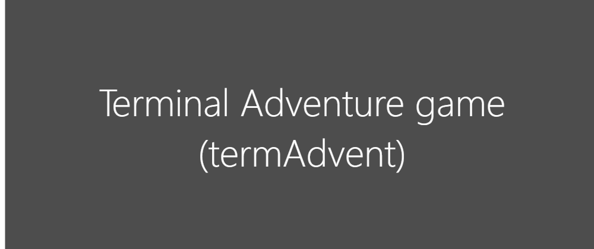

[comment]: # (below is the link for the banner)

[comment]: # (quick introduction of terminal adventure game / in javascript)
Terminal adventure game is a text based adventure made with Javascript.
Enter this fantastic world of castle, magic and treasure. 

**Will you be  able to find the long lost treasure!**

[comment]: # (content table - requirement, installation, usage, feature, snapshot, license)
## Content table
- Requirement
- Installation
- Usage
- Feature
- Snapshot
- [License](#License:)
[comment]: # (requirement - what you need to be able to play the game)

[comment]: # (installation - how to install it on all platform)

[comment]: # (usage - how to play)

[comment]: # (feature - what make it special)

[comment]: # (snapshot - some picture from the gameplay)

[comment]: # (license - explained the license)
## License:
This repositery use the [GPLv2 license](https://www.gnu.org/licenses/old-licenses/gpl-2.0.en.html). 
